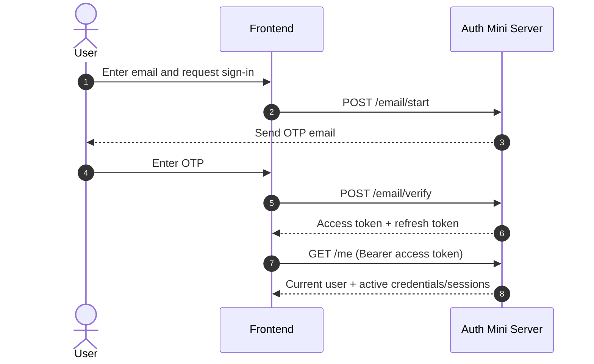
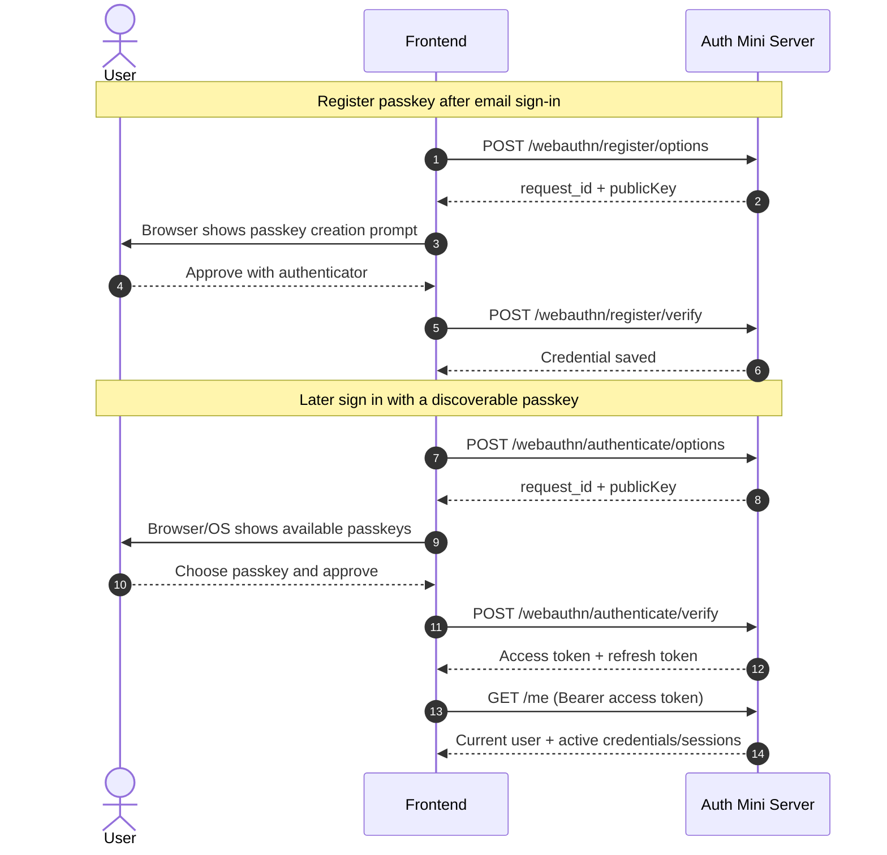
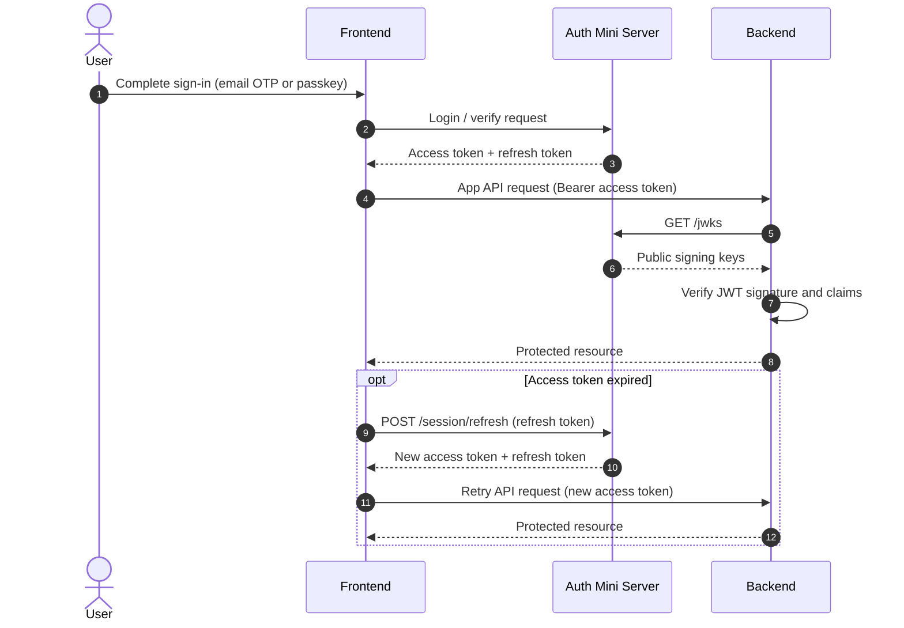

# auth-mini

Minimal, opinionated auth server for apps that just need auth.

auth-mini is built for the common case: you want email sign-in, passkeys, JWTs, and a database you can actually understand, without adopting a full backend platform (e.g. Supabase) just to get authentication working.

It uses email OTP for first login, discoverable WebAuthn credentials for username-less passkey login, and SQLite for storage. The goal is not to be an auth empire. The goal is to be small, clear, and easy to run.

## Demo / Docs

See `demo/` for the single-page static demo/docs site that doubles as the browser integration guide, API reference, deployment walkthrough, and JWT verification reference.

## Interaction flow

### Email OTP sign-in



### Passkey flow



### Full auth and backend verification



## Features

- Email sign-in with one-time passwords
- Discoverable WebAuthn credentials for username-less sign-in
- Access + refresh token sessions
- JWKS endpoint for access token verification
- SQLite storage for users, sessions, SMTP config, WebAuthn credentials, and challenges
- Hono HTTP server with a small operational footprint

## CLI

Create a database and optionally import SMTP config rows from a JSON file:

```bash
npx auth-mini create ./auth-mini.sqlite --smtp-config ./smtp.json
```

Start the server:

```bash
npx auth-mini start ./auth-mini.sqlite \
  --host 127.0.0.1 \
  --port 7777 \
  --issuer https://auth.example.com \
  --rp-id example.com \
  --origin https://app.example.com
```

Rotate JWKS keys:

```bash
npx auth-mini rotate jwks ./auth-mini.sqlite
```

By default, CLI errors stay concise; use `--verbose` for detailed diagnostics.

`rotate-jwks` remains available only as a transition/compatibility alias during the migration release.

## Logging

auth-mini writes structured JSON logs by default. The logs are suitable for redirection to a file:

```bash
npx auth-mini start ./auth-mini.sqlite --issuer https://auth.example.com --rp-id example.com --origin https://app.example.com >> auth-mini.log
```

In the current version, logs may contain plaintext email addresses and client IPs. Logs intentionally exclude OTP values, tokens, and SMTP passwords.

## SMTP import format

`--smtp-config` expects a JSON array. Every row must be valid or the whole import is rejected.

```json
[
  {
    "host": "smtp.example.com",
    "port": 587,
    "username": "mailer",
    "password": "secret",
    "from_email": "noreply@example.com",
    "from_name": "auth-mini",
    "secure": false,
    "weight": 1
  }
]
```

## HTTP API

### Public endpoints

- `POST /email/start` sends an OTP to the email address
- `POST /email/verify` verifies the OTP and returns an access/refresh token pair
- `POST /session/refresh` exchanges a refresh token for a new access/refresh token pair
- `POST /webauthn/authenticate/options` creates a username-less passkey challenge
- `POST /webauthn/authenticate/verify` verifies the passkey assertion and returns a session
- `GET /jwks` returns public keys for verifying access tokens

### Authenticated endpoints

Send `Authorization: Bearer <access_token>`.

- `GET /me`
- `POST /session/logout`
- `POST /webauthn/register/options`
- `POST /webauthn/register/verify`
- `DELETE /webauthn/credentials/:id`

Refresh uses the refresh token in the JSON body:

```json
{ "refresh_token": "..." }
```

`GET /me` returns the current user, stored WebAuthn credentials, and only active sessions.

## Browser SDK

auth-mini also serves a singleton browser SDK at `GET /sdk/singleton-iife.js`.

Load the script from the auth server origin. The singleton SDK still infers its API base URL from its own `src`, so the script origin and API origin must match:

```html
<script src="https://auth.example.com/sdk/singleton-iife.js"></script>
<script>
  window.MiniAuth.session.onChange((state) => {
    console.log('auth status:', state.status);
  });
</script>
```

v1 is intentionally zero-config: the script infers its API base URL from its own `src`, persists session state in `localStorage`, and automatically refreshes access tokens. Browser pages may be hosted on a different origin than the auth server as long as the page origin is explicitly allowed with `--origin` when you start auth-mini.

Same-origin proxy deployment is still supported if you prefer to front auth-mini through your app origin, but direct cross-origin loading is now the primary browser SDK path.

For example, this page:

- page origin: `http://localhost:3000`
- auth server origin: `http://127.0.0.1:7777`

works when auth-mini is started with `--origin http://localhost:3000` and the page loads the SDK from the auth server:

```html
<script src="http://127.0.0.1:7777/sdk/singleton-iife.js"></script>
```

The published demo/docs page does **not** auto-target localhost anymore. It stays in a neutral docs-only state until you provide `?sdk-origin=https://your-auth-origin`, which makes the playground load the SDK from that auth origin.

### Publishing the single-page demo/docs

The static site lives in `demo/`.

- Publish the **contents of `demo/`** so `index.html`, `./style.css`, and `./main.js` stay at the final URL you want browsers to open.
- For GitHub Pages, that means publishing `demo/` as the Pages artifact (for example via a Pages Action that uploads `demo/`, or by copying `demo/` into the branch/folder Pages serves).
- Project Pages subpaths such as `https://<user>.github.io/auth-mini/` are fine because the demo uses relative local assets.
- `auth-mini --origin ...` must match the final **page origin** (`window.location.origin`), not the auth server origin. Path changes like `/auth-mini/` vs `/demo/` do not change `--origin`, but moving between `https://docs.example.com` and `https://example.github.io` does.
- If the docs page and auth server live on different origins, keep the docs page on its static host and append `?sdk-origin=https://your-auth-origin` so the page loads `/sdk/singleton-iife.js` from the auth server.
- If you attach a custom GitHub Pages domain, publish a matching `CNAME` file in the Pages artifact/root so GitHub serves that domain consistently; then start auth-mini with `--origin https://your-domain.example`.

Example:

- published docs origin: `https://example.github.io`
- auth server origin: `https://auth.example.com`

Open:

```text
https://example.github.io/auth-mini/?sdk-origin=https://auth.example.com
```

Start auth-mini with:

```bash
auth-mini start ./auth-mini.sqlite --issuer https://auth.example.com --origin https://example.github.io --rp-id auth.example.com
```

### Startup state model

If a refresh token is already stored, startup enters `recovering` first and then settles to `authenticated` or `anonymous` after recovery completes. During recovery, `MiniAuth.me.get()` may return the last cached snapshot while `MiniAuth.session.getState().status` still reports `recovering`.

### `me.get()` vs `me.reload()`

- `MiniAuth.me.get()` returns the current cached `/me` snapshot synchronously.
- `MiniAuth.me.reload()` performs authenticated network I/O, follows the SDK refresh rules, updates cached state, and resolves with the fresh `/me` payload.

### Passkey example

```html
<script src="https://auth.example.com/sdk/singleton-iife.js"></script>
<script>
  async function signIn(email, code) {
    await window.MiniAuth.email.start({ email });
    await window.MiniAuth.email.verify({ email, code });
    console.log(window.MiniAuth.me.get());
  }

  async function signInWithPasskey() {
    await window.MiniAuth.webauthn.authenticate();
    console.log(window.MiniAuth.me.get());
  }
</script>
```

### Operational limits

- The SDK script origin must match the auth API origin because the singleton client derives its base URL from the script `src`.
- Cross-origin browser pages are supported only when the page origin is included in `--origin`.
- Multiple tabs sharing one session can currently race during refresh-token rotation and invalidate one another. This is a known SDK bug, not a product contract.

## WebAuthn flow

1. Sign in with email OTP.
2. Call `POST /webauthn/register/options` while authenticated.
3. Pass `publicKey` into `navigator.credentials.create()`.
4. Send `{ request_id, credential }` to `POST /webauthn/register/verify`.
5. Later, call `POST /webauthn/authenticate/options` with an empty body.
6. Pass `publicKey` into `navigator.credentials.get()`.
7. Send `{ request_id, credential }` to `POST /webauthn/authenticate/verify`.

auth-mini uses discoverable credentials for passkey login. Users sign in with email first, register a passkey while authenticated, and can later sign in directly with the passkey without entering an email address first.

Registration options require discoverable credentials:

```json
{
  "request_id": "<uuid>",
  "publicKey": {
    "challenge": "<base64url>",
    "rp": { "name": "auth-mini", "id": "example.com" },
    "user": {
      "id": "<base64url>",
      "name": "user@example.com",
      "displayName": "user@example.com"
    },
    "pubKeyCredParams": [
      { "type": "public-key", "alg": -7 },
      { "type": "public-key", "alg": -257 }
    ],
    "timeout": 300000,
    "authenticatorSelection": {
      "residentKey": "required",
      "userVerification": "preferred"
    }
  }
}
```

Authentication options are username-less and intentionally omit `allowCredentials`:

```json
{
  "request_id": "<uuid>",
  "publicKey": {
    "challenge": "<base64url>",
    "rpId": "example.com",
    "timeout": 300000,
    "userVerification": "preferred"
  }
}
```

WebAuthn registration and authentication verification now use `@simplewebauthn/server`. auth-mini intentionally limits advertised registration algorithms to `-7` (ES256) and `-257` (RS256), because those are the algorithms explicitly covered by the integration test suite.

Generating a new registration challenge invalidates the previous unused registration challenge for the same signed-in user. Authentication challenges are preserved so concurrent sign-in attempts can complete independently.

## Philosophy

### Why not a full auth platform?

If your project only needs authentication, adopting a large backend platform can be unnecessary overhead. auth-mini is for the case where you want to run a focused auth service yourself, keep the moving parts small, and understand exactly where your users, sessions, SMTP config, and signing keys live.

### Why email OTP first?

Email is familiar, universal, and gives you a practical recovery and communication channel. For many products, that matters more than inventing another username-password system or expecting every user to already understand wallets, private keys, or more exotic login flows.

### Why passwordless and discoverable passkeys?

Passwords are easy to forget, easy to reuse, and expensive to defend forever. Email OTP removes the long-lived shared secret, and WebAuthn goes further by letting the device authenticate with phishing-resistant credentials. auth-mini specifically uses discoverable credentials so passkey login can be truly username-less instead of pretending to be passwordless while still asking for an identifier first.

### Why SQLite?

Auth data is usually small and operational simplicity matters. SQLite is easy to run, back up, inspect, and move around. In this design, that trade-off is often better than introducing a separate database server just because auth sounds important. JWT verification also stays stateless on the consumer side, so not every authenticated request has to hit the database.

### Why access + refresh tokens?

Access tokens should be short-lived. Refresh tokens should be revocable and rotated. auth-mini keeps those roles separate: access tokens are JWTs signed by your keys and suitable for API verification, while refresh tokens are random database-backed secrets that can be invalidated and replaced on every refresh. That keeps API auth simple without pretending JWTs are easy to revoke after they leak.

## Development

```bash
npm run format
npm run lint
npm run typecheck
npm test
```

## License

MIT License
